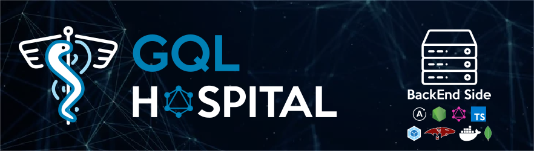

## Project type

**Pet project**

This project is being developed in order to research and test different web development tools.

This is not a professional solution nor must be used in real environments.

## Target

Implement the backend in order to handle a hospital staff and patients management.

## Installation and start-up

This code works with a **frontend** which code is available at this repository: [GQL Hospital FrontEnd](https://github.com/ddialar/gql.hospital.frontend.vue.git).

Besides that, in order to operate with the MongoDB database, you need to have installed Docker CE into your computer.

Before hand on with the server, you must know that this repository is organized in several branches. Currently, the brach which is activelly developed is **implementing-mongodb** one.

The BackEnd installation process is next:

```sh
git clone https://github.com/ddialar/gql.hospital.backend.git gql.hospital.backend
cd gql.hospital.frontend
git checkout implemeting-mongodb
npm i
```

It's time to create the MongoDB container.

```sh
npm run database:build
```

Once the container has been successfully created, it's time to run the server.

```sh
npm run build:dev
```

## Credits

### Medicine icon
Created by: **Zlatko Najdenovski**
Resource available at: [Medicine icon](https://www.flaticon.com/free-icon/medicine_181911)

### Server icon
Created by: **Flat Icon**
Resource available at: [Monitor icon](https://www.flaticon.com/)